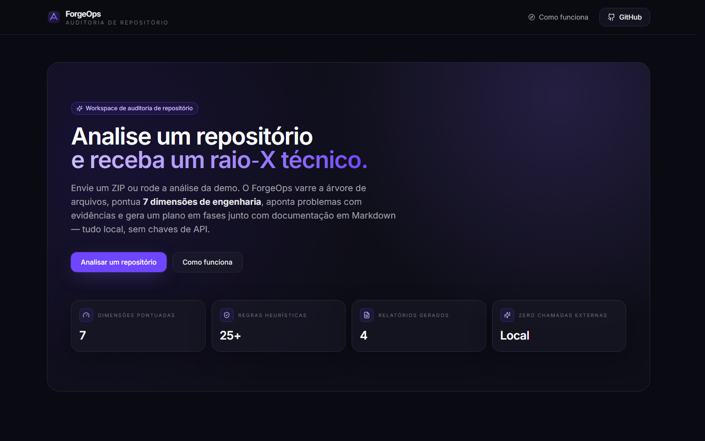
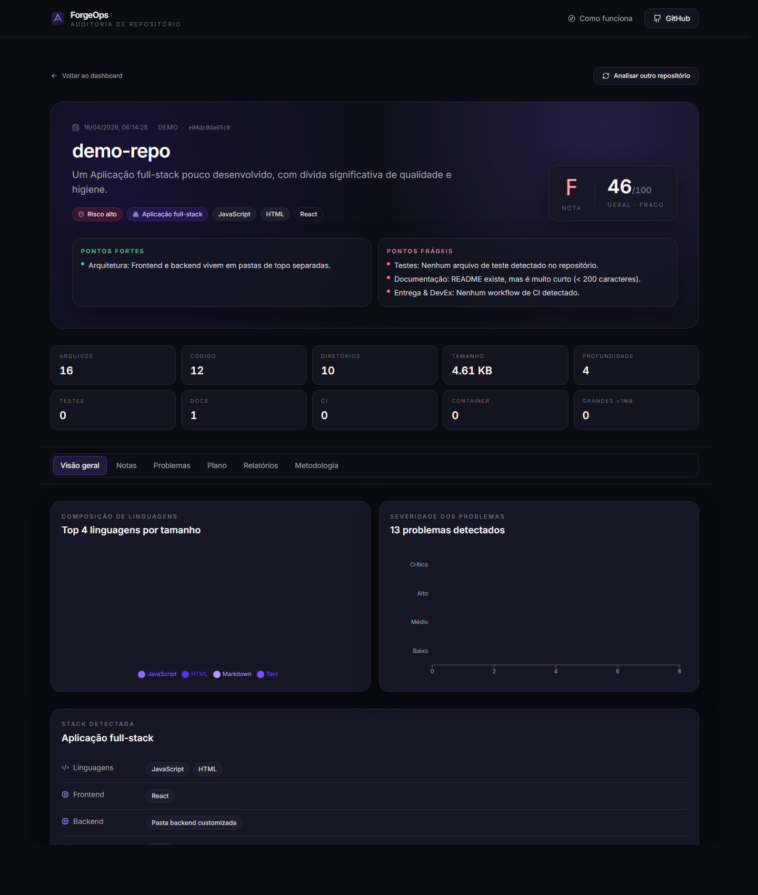
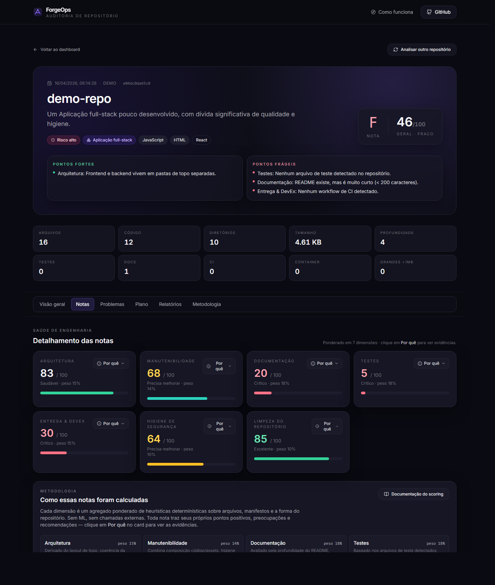
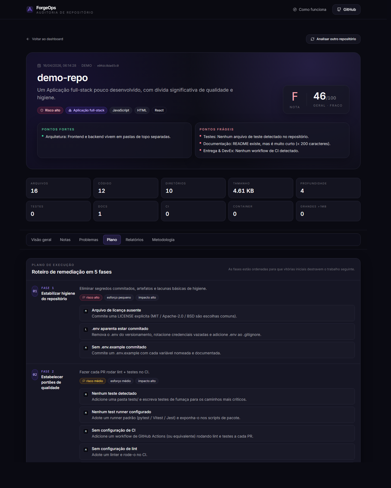

<div align="center">

# ForgeOps

**Auditoria técnica de repositórios — determinística, offline, pronta para portfólio.**

Envie um ZIP (ou clique em _Analisar demo_) e receba nota de saúde em sete dimensões,
backlog de problemas com evidência, plano de remediação em cinco fases e quatro
relatórios em Markdown.

[Rodando localmente](#rodando-localmente) · [Docker](#docker) · [Como a nota é calculada](docs/SCORING.md) · [Arquitetura](docs/ARCHITECTURE.md)



</div>

---

## Por que existe

* **Baseado em fatos.** Toda nota e todo achado remetem a um arquivo ou manifesto real. Heurísticas publicadas em [docs/SCORING.md](docs/SCORING.md), não escondidas num prompt.
* **Determinístico e offline.** Sem LLM, sem chave de API, sem telemetria. O mesmo repositório sempre produz o mesmo relatório.
* **Demo de um clique.** `samples/demo-repo/` é deliberadamente imperfeito e exercita todos os caminhos de scoring — o avaliador nunca precisa trazer o próprio ZIP.
* **Ingestão segura.** O extrator rejeita traversal (`..`), caminhos absolutos, symlinks e membros acima do limite antes de escrever um byte.
* **Stack enxuta.** Next.js 14 + FastAPI + SQLite. Zero dependência externa em runtime.

---

## Como funciona

```
ZIP → extração segura → scan → detecção de stack → scoring → problemas → plano → 4 relatórios
```

Cada estágio é uma função pura. O scanner percorre a árvore uma única vez; tudo a jusante (sete dimensões ponderadas, ~25 regras de problema, backlog priorizado, plano em cinco fases, quatro documentos Markdown) consome o mesmo `ScanResult`.

| Dimensão               | Peso | Sinais                                                                         |
|------------------------|:----:|--------------------------------------------------------------------------------|
| Documentação           | 0.18 | README, `docs/`, CHANGELOG, CONTRIBUTING, LICENSE, `.env.example`               |
| Testes                 | 0.18 | Razão teste/código, runner detectado, presença de e2e                          |
| Arquitetura            | 0.15 | Separação frontend/backend, profundidade, coerência de framework               |
| Entrega & DevEx        | 0.15 | CI, containerização, lint + formatter                                          |
| Manutenibilidade       | 0.14 | Mix código/assets, binários, lockfile, poluição de topo                        |
| Higiene de Segurança   | 0.10 | `.env` commitado, `.gitignore`, nomes de arquivo suspeitos                     |
| Limpeza do Repositório | 0.10 | Lixo de SO, `build/`/`dist/` commitados, `node_modules/` na raiz               |

`geral = round(Σ score_i · peso_i)` — notas **A** ≥ 90, **B** ≥ 80, **C** ≥ 70, **D** ≥ 60, **F** caso contrário. Lista completa em [docs/SCORING.md](docs/SCORING.md).

---

## Capturas

| Landing | Visão geral |
|:---:|:---:|
|  |  |
| **Notas por dimensão** | **Plano de execução** |
|  |  |

---

## Stack

**Frontend** — Next.js 14 (App Router), React 18, TypeScript 5, Tailwind 3, Recharts, lucide-react.
**Backend** — FastAPI 0.115, Pydantic 2, uvicorn, `python-multipart`, `sqlite3` da stdlib.
**Tooling** — pytest, Docker + docker-compose, saída `standalone` do Next.js.

Nenhum LLM, chave de API ou serviço externo é usado em qualquer parte da stack.

---

## Rodando localmente

Requisitos: **Python 3.11+** e **Node 20+**.

```bash
# Backend
cd apps/api
python -m venv .venv && source .venv/bin/activate   # Windows: .venv\Scripts\activate
pip install -r requirements.txt
uvicorn forgeops.main:app --reload --port 8000

# Frontend (outro terminal)
cd apps/web
npm install
NEXT_PUBLIC_API_BASE_URL=http://localhost:8000 npm run dev
```

Abra <http://localhost:3000> e clique em **Analisar repositório demo** — sem upload necessário.

Testes do backend:

```bash
cd apps/api && pytest
```

Seis testes cobrem o extrator zip-safe, o scanner, a detecção de stack, o scoring, a geração de problemas e os relatórios.

---

## Docker

```bash
docker compose up --build
```

API em <http://localhost:8000>, web em <http://localhost:3000>. A imagem web é construída a partir da saída `standalone` do Next.js; a imagem da API embute `samples/demo-repo`. SQLite persiste em um volume nomeado (`forgeops-data`).

---

## Estrutura

```
ops/
├─ apps/
│  ├─ api/                     # FastAPI + scoring engine
│  │  ├─ forgeops/             # analyzer, scoring, generators, storage, api
│  │  └─ tests/                # pytest
│  └─ web/                     # Next.js 14 App Router
│     ├─ app/                  # rotas
│     ├─ components/           # landing, analysis, shared, ui
│     └─ lib/                  # api client, types, utils, markdown
├─ samples/demo-repo/          # repositório imperfeito embutido
├─ docs/                       # ARCHITECTURE, SCORING, BUILD_LOG
├─ assets/screenshots/
├─ docker-compose.yml
└─ .env.example
```

Mapa detalhado em [docs/ARCHITECTURE.md](docs/ARCHITECTURE.md).

---

## Roadmap

* Ingestão direta de URL do GitHub (público + PAT)
* Visão histórica: sobrepor duas análises do mesmo repo para mostrar o delta
* Export PDF de uma página além dos quatro relatórios Markdown
* Perfis de scoring plugáveis (startup, enterprise, biblioteca)
* Passada LLM opcional que apenas *enriquece* campos narrativos — sem tocar nas notas

---

## Licença

[MIT](LICENSE) © 2026 ForgeOps.
